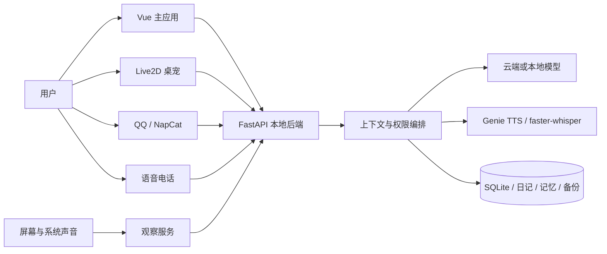

# Mio

> Windows 本地优先的个人 AI Agent：让对话、长期记忆、日记、主动联系、QQ、语音、Live2D 与屏幕观察共享同一个角色和数据闭环。

[](LICENSE)
[](#运行要求)
[](#当前状态)

Mio 不是单独的聊天网页，也不是把许多 AI 功能堆在一起的启动器。它尝试把一个长期存在的个人 Agent 放进真实桌面环境：同一份人格、记忆和生活记录可以同时服务于主应用、桌宠、QQ、语音电话、日记与屏幕观察；涉及联网、截图、主动联系或本地行动时，能力边界和当前状态应当可见、可暂停、可恢复。

项目目前以 Windows 单机使用为主，仍处于预览阶段。

## 核心能力

| 方向 | 能力 |
|---|---|
| 对话与模型 | 多会话、OpenAI 兼容供应商、Responses / Chat Completions、思考档位、Token 与费用记录、图片/PDF/Word/文本附件 |
| 长期记录 | SQLite 对话、结构化记忆、今日状态、日记、周记、月记、回顾、导出与完整备份恢复 |
| 主动性 | 可配置的主动消息、未完成话题跟进、定时日记与回顾；默认关闭高费用或敏感自动能力 |
| 桌面角色 | Vue 主应用、独立 Live2D 桌宠、文字气泡、动作/表情、语音口型和播放队列 |
| 语音 | Genie ONNX 本地角色音色、中文/日语朗读、faster-whisper 电话与系统声音转写、主动打断 |
| 视觉与环境 | 屏幕/窗口/游戏变化检测、本地或云端视觉、系统声音上下文、观察触发与费用边界 |
| QQ | NapCat / OneBot 私聊与群聊、登录状态诊断、主动消息同步 |
| 隐私与可靠性 | 本地数据目录、DPAPI 密钥、敏感能力总控、迁移账本、带清单和 SHA-256 的备份恢复、运行身份诊断 |

## 设计重点

### 一个 Agent，多种入口

主应用、QQ、桌宠、电话和观察不是五个彼此独立的机器人。它们通过同一个本地后端共享人格、近期上下文、记忆、日记、模型配置与权限状态。

### 本地优先，不等于完全离线

聊天、日记、记忆、设置和备份默认保存在本机。使用云端模型、联网搜索或云端视觉时，必要上下文会发送给用户选择的供应商；本地视觉和本地语音可以减少出机内容，但需要用户自行安装对应模型。

### 主动能力必须可解释

主动联系、QQ、自动日记、屏幕观察和系统声音默认不会因为“代码里存在”就自动开启。设置页会展示当前开关、运行状态、错误与费用边界，并提供统一的隐私暂停入口。

## 架构



FastAPI 仅监听 `127.0.0.1`。Windows 启动器负责拉起后端并把 Vue 页面嵌入主窗口；Live2D 使用独立 Electron 进程，但仍连接同一个本地 Agent。

## 目录

```text
Mio/
├─ 私人AI日记系统/       # FastAPI、SQLite、日记、记忆、QQ、语音、观察
├─ 澪Agent应用/          # Vue 主界面、Windows 启动器、Electron Live2D
├─ README.md
├─ CONTRIBUTING.md
├─ SECURITY.md
└─ LICENSE
```

两个子目录保留当前中文名称，是为了兼容现有 Windows 构建与源码发现逻辑。最终用户只会看到一个名为 Mio 的桌面应用。

## 运行要求

- Windows 11（当前主要验证环境）
- Python 3.10+
- Node.js 22.12+
- WebView2 Runtime
- 至少一个可用的 OpenAI 兼容模型供应商，或自行配置本地模型

以下能力是可选的：NapCat / NT QQ、本地视觉、Genie 本地音色、faster-whisper、OBS、Live2D 模型。

## 从源码启动

### 1. 启动后端

```powershell
cd .\私人AI日记系统\backend
py -3.10 -m venv .venv
.\.venv\Scripts\python.exe -m pip install -r requirements.txt
Copy-Item .env.example .env
.\.venv\Scripts\python.exe -m uvicorn app.main:app --host 127.0.0.1 --port 8000
```

浏览器打开 `http://127.0.0.1:8000/agent-app/` 即可使用主界面。

### 2. 构建桌面界面

```powershell
cd .\澪Agent应用
npm ci
npm run build
```

开发预览可执行：

```powershell
powershell.exe -NoProfile -ExecutionPolicy Bypass -File .\启动预览.ps1
```

Windows 完整构建：

```powershell
powershell.exe -NoProfile -ExecutionPolicy Bypass -File .\构建Windows应用.ps1
```

## 首次使用

1. 完成首次启动向导并确认数据目录。
2. 在“设置 > 模型与 API”添加供应商和模型。
3. 根据需要编辑角色卡、人格、称呼和行为边界。
4. 再单独安装或开启 QQ、语音、本地视觉、主动消息与观察功能。
5. 使用“设置 > 数据与隐私”建立第一份完整备份。

公开源码不包含作者的私人角色设定、聊天、日记、API Key、QQ 登录态、角色音色、训练参考音频、模型权重或私人 Live2D / 图片资产。

## 测试

```powershell
cd .\私人AI日记系统\backend
.\.venv\Scripts\python.exe -m compileall app
.\.venv\Scripts\python.exe -m unittest discover -s tests

cd ..\..\澪Agent应用
npm ci
npm test
npm run build

python -m unittest discover -s desktop -p "test_*.py"

cd .\live2d-desktop
npm ci
npm run test:model
```

## 当前状态

- 当前预览版本：`0.7.0`
- 当前主要平台：Windows
- 已完成自动化回归、构建、隔离数据测试和多轮正式运行验收；真人麦克风、QQ 登录、第三方模型下载、不同显卡/声卡与长时间自然使用仍可能受环境影响。
- Mio 目前适合愿意自行配置模型和可选能力的开发者或体验者，不应被视为无需维护的成熟商业产品。
- 当前公开构建未进行代码签名，Windows 可能显示 SmartScreen 提示；请只从项目正式 Release 下载并核对 SHA-256。

已知限制和后续计划见子项目文档与 Issues。

## 隐私与安全

请先阅读：

- [隐私说明](私人AI日记系统/文档/隐私说明.md)
- [安全说明](SECURITY.md)
- [资产与第三方许可](私人AI日记系统/文档/资产与第三方许可.md)

不要在 Issue 中上传真实 API Key、QQ Token、聊天数据库、日记、私人截图、音色或日志原文。

## 许可证

原创源代码与文档使用 [MIT License](LICENSE)。Live2D Cubism、示例模型、第三方库、角色图片、音色、训练数据和用户自行导入的资产遵循各自许可证，不因本仓库采用 MIT 而自动获得重新分发权。

## 贡献

欢迎提交 Issue 和聚焦的 Pull Request。修改共享行为时请补充测试；涉及联网、屏幕、QQ、主动消息、备份、模型下载或本地行动时，请同时说明权限边界、失败状态和隐私影响。
