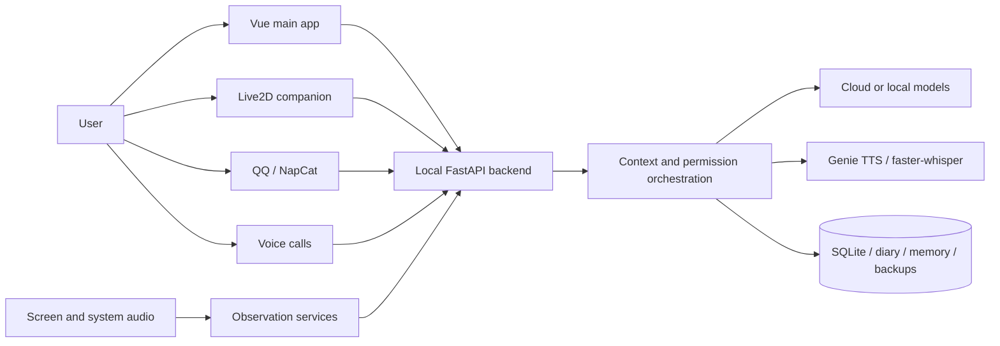

# Mio

<p align="center">
  
</p>

<p align="center">
  <a href="README.md">中文</a> | English
</p>

> A local-first personal AI Agent for Windows that connects conversations, long-term memory, diaries, proactive contact, QQ, voice, Live2D, and screen awareness through one shared character and data loop.

[](LICENSE)
[](#requirements)
[](#project-status)

Mio is not just a chat webpage or a launcher that bundles unrelated AI features. It explores what it takes to keep one personal Agent present across a real desktop environment. The main app, desktop companion, QQ, voice calls, diary, and screen observation share the same persona, memory, life records, model configuration, and permission state.

The project currently targets single-user Windows installations and is still in preview.

## Core Capabilities

| Area | Capabilities |
|---|---|
| Chat and models | Multiple conversations, OpenAI-compatible providers, Responses and Chat Completions APIs, reasoning levels, token and cost records, image/PDF/Word/text attachments |
| Long-term records | SQLite conversations, structured memory, daily state, diary, weekly and monthly reviews, export, backup, and restore |
| Proactivity | Configurable proactive messages, unfinished-topic follow-up, scheduled diaries and reviews; sensitive or costly automation is disabled by default |
| Desktop character | Vue main app, independent Live2D companion, chat bubble, actions, expressions, speech lip sync, and playback queue |
| Voice | Local Genie ONNX character voice, Chinese and Japanese reading, faster-whisper calls and system-audio transcription, active interruption |
| Vision and environment | Screen/window/game change detection, local or cloud vision, system-audio context, observable triggers, and cost boundaries |
| QQ | NapCat / OneBot private and group chats, login diagnostics, and proactive-message synchronization |
| Privacy and reliability | Local data directory, DPAPI secrets, sensitive-capability controls, migration ledger, verified backups, and runtime identity diagnostics |

## Design Principles

### One Agent, multiple surfaces

The main app, QQ, desktop companion, calls, and observation services are not separate bots. They connect to one local backend and share persona, recent context, memory, diaries, models, and permission state.

### Local-first does not mean fully offline

Chats, diaries, memory, settings, and backups stay on the local machine by default. When a cloud model, web search, or cloud vision is used, the required context is sent to the provider selected by the user. Local vision and voice can reduce outbound data but require separately installed models.

### Proactive behavior must remain inspectable

Proactive contact, QQ, automatic diaries, screen observation, and system-audio observation are not enabled merely because the code exists. Settings expose their switches, runtime state, errors, and cost boundaries, with a global privacy pause.

## Architecture



FastAPI only listens on `127.0.0.1`. The Windows launcher starts the backend and embeds the Vue app in the main window. Live2D runs in a separate Electron process while connecting to the same local Agent.

## Repository Layout

```text
Mio/
|- 私人AI日记系统/       # FastAPI, SQLite, diary, memory, QQ, voice, observation
|- 澪Agent应用/          # Vue UI, Windows launcher, Electron Live2D
|- README.md             # Chinese introduction
|- README_EN.md          # English introduction
|- THIRD_PARTY_NOTICES.md
|- CONTRIBUTING.md
|- SECURITY.md
`- LICENSE
```

The two Chinese source-directory names are retained for compatibility with the existing Windows build and source-discovery logic. End users see a single desktop application named Mio.

## Requirements

- Windows 11, the primary verified environment
- Python 3.10+
- Node.js 22.12+
- WebView2 Runtime
- At least one OpenAI-compatible model provider, or a configured local model

NapCat / NT QQ, local vision, Genie local voice, faster-whisper, OBS, and custom Live2D models are optional.

## Run from Source

### Backend

```powershell
cd .\私人AI日记系统\backend
py -3.10 -m venv .venv
.\.venv\Scripts\python.exe -m pip install -r requirements.txt
Copy-Item .env.example .env
.\.venv\Scripts\python.exe -m uvicorn app.main:app --host 127.0.0.1 --port 8000
```

Open `http://127.0.0.1:8000/agent-app/` in a browser.

### Desktop UI

```powershell
cd .\澪Agent应用
npm ci
npm run build
powershell.exe -NoProfile -ExecutionPolicy Bypass -File .\启动预览.ps1
```

Build the complete Windows application with:

```powershell
powershell.exe -NoProfile -ExecutionPolicy Bypass -File .\构建Windows应用.ps1
```

## First Run

1. Complete the first-run wizard and confirm the data directory.
2. Add a provider and model under Settings > Models and API.
3. Edit the character card, persona, names, and behavior boundaries as needed.
4. Install or enable QQ, voice, local vision, proactive messages, and observation separately.
5. Create the first full backup under Settings > Data and Privacy.

The public repository does not contain the author's private persona, conversations, diaries, API keys, QQ login state, character voice, training references, model weights, or private Live2D and image assets.

## Project Status

- Current preview version: `0.1.0`
- Primary platform: Windows
- Automated regression, builds, isolated-data tests, and multiple real-run acceptance rounds have been completed. Real microphones, QQ login, third-party downloads, different GPUs/audio devices, and long natural sessions can still vary by environment.
- Mio is currently intended for developers and evaluators willing to configure models and optional capabilities. It should not be treated as a maintenance-free commercial product.
- Public builds are not code-signed yet. Windows may show a SmartScreen warning; only download from the official Release and verify SHA-256.

## Privacy, Licenses, and Credits

- [Privacy notes](私人AI日记系统/文档/隐私说明.md)
- [Security policy](SECURITY.md)
- [Asset and third-party license boundaries](私人AI日记系统/文档/资产与第三方许可.md)
- [Third-party projects and acknowledgements](THIRD_PARTY_NOTICES.md)

Original source code and documentation are released under the [MIT License](LICENSE). Live2D Cubism, sample models, third-party libraries, character images, voice assets, training data, and user-imported assets keep their own licenses and redistribution terms.

Do not upload real API keys, QQ tokens, chat databases, diaries, private screenshots, voice assets, or raw logs to Issues.

## Contributing

Focused Issues and pull requests are welcome. Changes to shared behavior should include tests. Changes involving network access, screen capture, QQ, proactive messages, backups, model downloads, or local actions should also document permission boundaries, failure states, and privacy impact.
